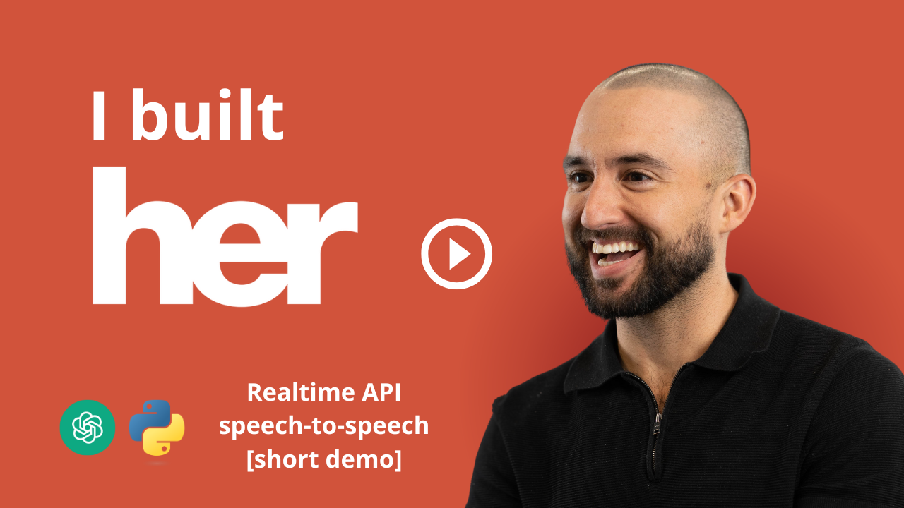

# Samantha OS¹ (Her) - Voice Mode Ready

<p align="center">
   <a href="https://fokkemars.com/os1">
    
  </a>
  <br>
  <em>Samantha OS¹ loading animation</em>
</p>

Samantha is an AI assistant inspired by the movie *Her*. This project is built to provide real-time voice interactions using the OpenAI Realtime API and Chainlit. Samantha acts as an agent that calls various tools to handle user requests, such as querying stock prices, executing SQL commands, generating images, and creating Python scripts.

## 🎤 Voice Mode Features

Samantha OS now features **fully working voice mode** with the following improvements:

- **Real-time voice conversation** with natural speech recognition
- **Fixed websockets compatibility** (websockets>=12.0)
- **Corrected OpenAI API headers** for realtime endpoint
- **Enhanced error handling** with clear feedback for setup issues
- **Structured tool responses** for better voice interaction
- **Session management** with 2-minute limits for cost control
- **Comprehensive setup guides** for easy configuration

## YouTube Demo
Watch a 2-minute demonstration of Samantha in action, where I showcase real-time voice interactions and various capabilities of the AI assistant.

<p align="center">
  <a href="https://www.youtube.com/watch?v=qVstKgrwX_o">
    
  </a>
  <br>
  <em>👆 Click the image to watch the demo on YouTube</em>
</p>

## 🚀 Quick Start (Voice Mode)

### Prerequisites
- **OpenAI API Key** (Required for voice mode)
- Python 3.12 or higher
- Microphone and speakers/headphones

### Easy Setup

#### Windows Users
1. **Set your OpenAI API key:**
   ```cmd
   set OPENAI_API_KEY=your_openai_api_key_here
   ```

2. **Run the startup script:**
   ```cmd
   start_voice_mode.bat
   ```

#### Linux/Mac Users
1. **Set your OpenAI API key:**
   ```bash
   export OPENAI_API_KEY="your_openai_api_key_here"
   ```

2. **Run the startup script:**
   ```bash
   python start_voice_mode.py
   ```

3. **Open your browser** to `http://localhost:8000`

4. **Press 'P' or click the microphone** to start voice conversation!

## 🐳 Docker Setup (Recommended)

### Quick Docker Start
1. **Create a `.env` file** with your API keys:
   ```
   OPENAI_API_KEY=your_openai_api_key_here
   USE_AZURE=false
   ```

2. **Build and run with Docker Compose:**
   ```bash
   docker-compose up --build -d
   ```

3. **Access the app** at `http://localhost:80`

### Manual Setup

#### Option 1: Using Virtual Environment

1. **Clone the Repository**
   ```sh
   git clone <your-repo-url>
   cd samantha-os1
   ```

2. **Set Up Virtual Environment**
   - Install `uv` package manager: [Installation Instructions](https://docs.astral.sh/uv/getting-started/installation/)
   - Create the virtual environment:
     ```sh
     uv sync
     ```
   - Activate the virtual environment:
     ```sh
     source .venv/bin/activate  # On Windows use `.venv\Scripts\activate`
     ```

3. **Environment Variables**
   - Create a `.env` file in the root directory with your API keys
   - **Required for voice mode:** `OPENAI_API_KEY`

4. **Run the Application**
   ```sh
   cd app
   chainlit run samantha.py
   ```

## 🔧 Voice Mode Configuration

### Required API Keys
- **OpenAI API Key** (Required): For real-time voice conversation
- **Groq API Key** (Optional): For faster text processing
- **Together AI API Key** (Optional): For image generation
- **Tavily API Key** (Optional): For web search functionality

### Troubleshooting Voice Mode

**Issue: "OpenAI API Key Missing"**
- Ensure `OPENAI_API_KEY` environment variable is set correctly
- Get your API key from [OpenAI Platform](https://platform.openai.com/api-keys)

**Issue: Voice not being detected**
- Check microphone permissions in your browser
- Ensure microphone is not muted
- Try refreshing the page

**Issue: No audio response**
- Check speaker/headphone volume
- Ensure audio output is not muted
- Check browser audio permissions

**Issue: Websockets error**
- This has been fixed in the current version
- Ensure you're using the latest code

## Tools and Features

This project includes several powerful tools:

- **Stock Price Queries**: Using the `yfinance` package, Samantha can query the latest stock price information.
- **Plotly Charts**: Visualizations are created using Plotly to provide insights.
- **Image Generation**: Samantha can generate images using AI models through the Together API.
- **Browser Interaction**: Open web pages based on prompts.
- **Internet Search**: Samantha can perform internet searches via the Tavily API.
- **LinkedIn Post Drafting**: Create LinkedIn posts based on given topics using an AI model.
- **Python Script Generation**: Generate Python scripts on-demand based on user-provided topics.
- **Python File Execution**: Create and execute Python scripts directly from the assistant.
- **🆕 Database Interaction**: Convert natural language to SQL and execute db commands with formatted results.
- **🆕 Email Drafting**: Compose professional, personalized emails with appropriate subject lines and content.

## 📚 Documentation

- [Voice Mode Setup Guide](VOICE_MODE_SETUP.md) - Detailed configuration instructions
- [Azure Deployment Guide](AZURE_DEPLOYMENT.md) - Deploy to Azure
- [Ultimate Samantha Guide](ULTIMATE_SAMANTHA_GUIDE.md) - Comprehensive usage guide

## 🔧 Recent Fixes

### Version 1.0.1 (Current)
- ✅ Fixed websockets compatibility issue (`additional_headers` error)
- ✅ Corrected OpenAI API headers for realtime endpoint
- ✅ Updated Docker configuration to properly use `.env` files
- ✅ Fixed URL detection logic for Azure vs OpenAI
- ✅ All dependencies properly installed and configured

### Known Issues Resolved
- ❌ ~~`BaseEventLoop.create_connection() got an unexpected keyword argument 'additional_headers'`~~ ✅ Fixed
- ❌ ~~`invalid_request_error` due to incorrect headers~~ ✅ Fixed
- ❌ ~~Container not reading `.env` file~~ ✅ Fixed

## 📄 License

This project is licensed under the MIT License - see the [LICENSE](LICENSE) file for details.
